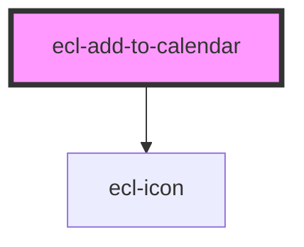

# ecl-add-to-calendar

<!-- Auto Generated Below -->

## Properties

| Property     | Attribute     | Description | Type      | Default     |
| ------------ | ------------- | ----------- | --------- | ----------- |
| `colorMode`  | `color-mode`  |             | `string`  | `''`        |
| `eventTitle` | `event-title` |             | `string`  | `undefined` |
| `fullWidth`  | `full-width`  |             | `boolean` | `false`     |
| `meta`       | `meta`        |             | `string`  | `undefined` |
| `styleClass` | `style-class` |             | `string`  | `''`        |
| `theme`      | `theme`       |             | `string`  | `undefined` |
| `withButton` | `with-button` |             | `boolean` | `true`      |

## Dependencies

### Depends on

- [ecl-icon](../ecl-icon)

### Graph

----------------------------------------------

*Built with [StencilJS](https://stenciljs.com/)*
