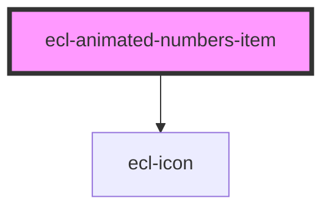

# ecl-animated-numbers-item

<!-- Auto Generated Below -->

## Properties

| Property          | Attribute           | Description | Type      | Default     |
| ----------------- | ------------------- | ----------- | --------- | ----------- |
| `category`        | `category`          |             | `string`  | `undefined` |
| `counterColor`    | `counter-color`     |             | `boolean` | `true`      |
| `description`     | `description`       |             | `string`  | `undefined` |
| `icon`            | `icon`              |             | `string`  | `undefined` |
| `itemPrefix`      | `item-prefix`       |             | `string`  | `undefined` |
| `itemPrefixLabel` | `item-prefix-label` |             | `string`  | `undefined` |
| `itemSuffix`      | `item-suffix`       |             | `string`  | `undefined` |
| `itemSuffixLabel` | `item-suffix-label` |             | `string`  | `undefined` |
| `styleClass`      | `style-class`       |             | `string`  | `undefined` |
| `theme`           | `theme`             |             | `string`  | `undefined` |
| `value`           | `value`             |             | `string`  | `undefined` |

## Dependencies

### Depends on

- [ecl-icon](../ecl-icon)

### Graph

----------------------------------------------

*Built with [StencilJS](https://stenciljs.com/)*
