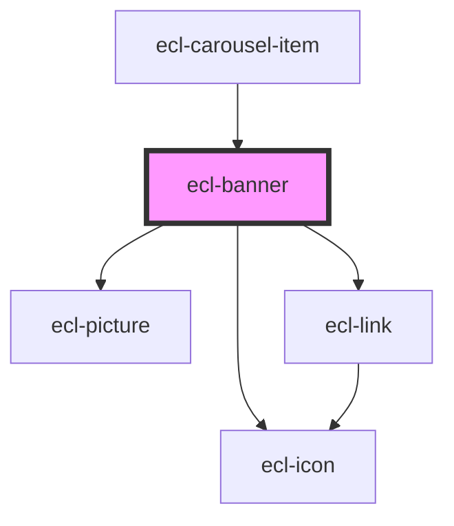

# ecl-banner

<!-- Auto Generated Below -->

## Properties

| Property      | Attribute      | Description | Type      | Default     |
| ------------- | -------------- | ----------- | --------- | ----------- |
| `bannerTitle` | `banner-title` |             | `string`  | `undefined` |
| `centered`    | `centered`     |             | `boolean` | `false`     |
| `credit`      | `credit`       |             | `string`  | `undefined` |
| `ctaClicked`  | `cta-clicked`  |             | `boolean` | `false`     |
| `ctaLabel`    | `cta-label`    |             | `string`  | `undefined` |
| `ctaLink`     | `cta-link`     |             | `string`  | `undefined` |
| `external`    | `external`     |             | `boolean` | `false`     |
| `fullWidth`   | `full-width`   |             | `boolean` | `false`     |
| `image`       | `image`        |             | `string`  | `undefined` |
| `imageAlt`    | `image-alt`    |             | `string`  | `undefined` |
| `size`        | `size`         |             | `string`  | `'m'`       |
| `styleClass`  | `style-class`  |             | `string`  | `undefined` |
| `theme`       | `theme`        |             | `string`  | `'ec'`      |
| `variant`     | `variant`      |             | `string`  | `'display'` |

## Dependencies

### Used by

 - [ecl-carousel-item](../ecl-carousel)

### Depends on

- [ecl-picture](../ecl-picture)
- [ecl-link](../ecl-link)
- [ecl-icon](../ecl-icon)

### Graph

----------------------------------------------

*Built with [StencilJS](https://stenciljs.com/)*
