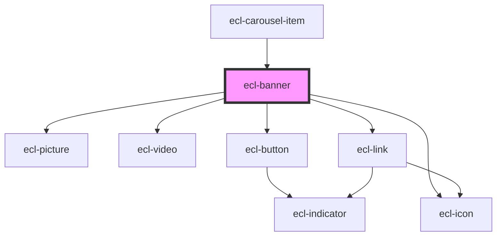

# ecl-banner

<!-- Auto Generated Below -->

## Properties

| Property          | Attribute           | Description | Type      | Default     |
| ----------------- | ------------------- | ----------- | --------- | ----------- |
| `bannerTitle`     | `banner-title`      |             | `string`  | `undefined` |
| `bannerTitleLink` | `banner-title-link` |             | `string`  | `undefined` |
| `boxBackground`   | `box-background`    |             | `string`  | `'light'`   |
| `colorMode`       | `color-mode`        |             | `string`  | `''`        |
| `credit`          | `credit`            |             | `string`  | `undefined` |
| `ctaClicked`      | `cta-clicked`       |             | `boolean` | `false`     |
| `ctaLabel`        | `cta-label`         |             | `string`  | `undefined` |
| `ctaLink`         | `cta-link`          |             | `string`  | `undefined` |
| `eclScript`       | `ecl-script`        |             | `boolean` | `false`     |
| `external`        | `external`          |             | `boolean` | `false`     |
| `fontColor`       | `font-color`        |             | `string`  | `'dark'`    |
| `fontSize`        | `font-size`         |             | `string`  | `'m'`       |
| `fullWidth`       | `full-width`        |             | `boolean` | `false`     |
| `horizontal`      | `horizontal`        |             | `string`  | `'left'`    |
| `image`           | `image`             |             | `string`  | `undefined` |
| `imageAlt`        | `image-alt`         |             | `string`  | `undefined` |
| `size`            | `size`              |             | `string`  | `'m'`       |
| `sources`         | `sources`           |             | `string`  | `undefined` |
| `srPause`         | `sr-pause`          |             | `string`  | `undefined` |
| `srPlay`          | `sr-play`           |             | `string`  | `undefined` |
| `styleClass`      | `style-class`       |             | `string`  | `undefined` |
| `theme`           | `theme`             |             | `string`  | `undefined` |
| `tracks`          | `tracks`            |             | `string`  | `undefined` |
| `vertical`        | `vertical`          |             | `string`  | `'center'`  |

## Dependencies

### Used by

 - [ecl-carousel-item](../ecl-carousel)

### Depends on

- [ecl-picture](../ecl-picture)
- [ecl-video](../ecl-video)
- [ecl-button](../ecl-button)
- [ecl-icon](../ecl-icon)
- [ecl-link](../ecl-link)

### Graph

```mermaid
graph TD;
  ecl-banner --> ecl-picture
  ecl-banner --> ecl-video
  ecl-banner --> ecl-button
  ecl-banner --> ecl-icon
  ecl-banner --> ecl-link
  ecl-button --> ecl-indicator
  ecl-link --> ecl-icon
  ecl-link --> ecl-indicator
  ecl-carousel-item --> ecl-banner
  style ecl-banner fill:#f9f,stroke:#333,stroke-width:4px
```

----------------------------------------------

*Built with [StencilJS](https://stenciljs.com/)*
