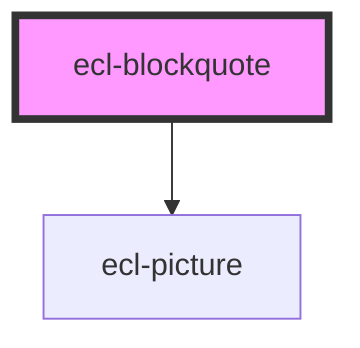

# ecl-blockquote

<!-- Auto Generated Below -->

## Properties

| Property     | Attribute     | Description | Type     | Default     |
| ------------ | ------------- | ----------- | -------- | ----------- |
| `author`     | `author`      |             | `string` | `undefined` |
| `colorMode`  | `color-mode`  |             | `string` | `undefined` |
| `image`      | `image`       |             | `string` | `undefined` |
| `imageAlt`   | `image-alt`   |             | `string` | `undefined` |
| `language`   | `language`    |             | `string` | `'en'`      |
| `styleClass` | `style-class` |             | `string` | `''`        |
| `theme`      | `theme`       |             | `string` | `'ec'`      |

## Dependencies

### Depends on

- [ecl-picture](../ecl-picture)

### Graph

----------------------------------------------

*Built with [StencilJS](https://stenciljs.com/)*
