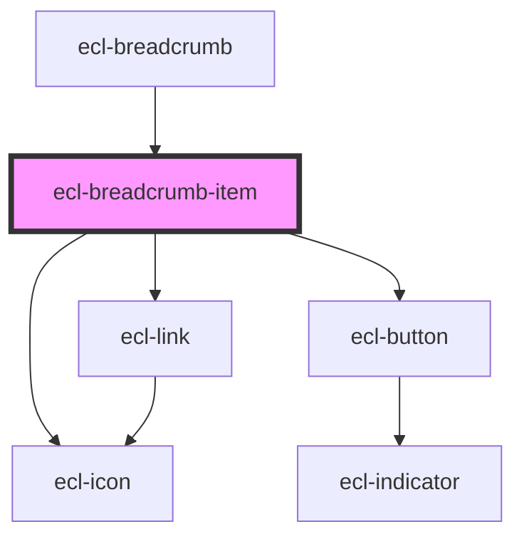

# ecl-breadcrumb-item

<!-- Auto Generated Below -->

## Properties

| Property          | Attribute           | Description | Type      | Default     |
| ----------------- | ------------------- | ----------- | --------- | ----------- |
| `buttonAriaLabel` | `button-aria-label` |             | `string`  | `''`        |
| `currentPage`     | `current-page`      |             | `boolean` | `false`     |
| `ellipsis`        | `ellipsis`          |             | `boolean` | `false`     |
| `path`            | `path`              |             | `string`  | `''`        |
| `styleClass`      | `style-class`       |             | `string`  | `''`        |
| `theme`           | `theme`             |             | `string`  | `undefined` |

## Dependencies

### Used by

 - [ecl-breadcrumb](.)

### Depends on

- [ecl-link](../ecl-link)
- [ecl-button](../ecl-button)
- [ecl-icon](../ecl-icon)

### Graph

----------------------------------------------

*Built with [StencilJS](https://stenciljs.com/)*
