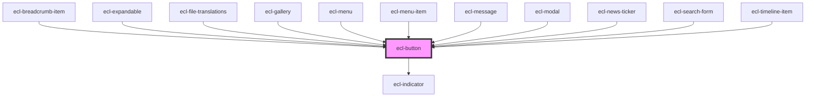

# ecl-button

<!-- Auto Generated Below -->

## Properties

| Property         | Attribute         | Description | Type      | Default     |
| ---------------- | ----------------- | ----------- | --------- | ----------- |
| `ariaControls`   | `aria-controls`   |             | `string`  | `undefined` |
| `disabled`       | `disabled`        |             | `boolean` | `false`     |
| `hideLabel`      | `hide-label`      |             | `boolean` | `false`     |
| `indicator`      | `indicator`       |             | `boolean` | `false`     |
| `indicatorValue` | `indicator-value` |             | `string`  | `''`        |
| `itemId`         | `item-id`         |             | `string`  | `undefined` |
| `styleClass`     | `style-class`     |             | `string`  | `''`        |
| `theme`          | `theme`           |             | `string`  | `'ec'`      |
| `type`           | `type`            |             | `string`  | `'submit'`  |
| `variant`        | `variant`         |             | `string`  | `'primary'` |

## Dependencies

### Used by

 - [ecl-breadcrumb-item](../ecl-breadcrumb)
 - [ecl-expandable](../ecl-expandable)
 - [ecl-file-translations](../ecl-file)
 - [ecl-gallery](../ecl-gallery)
 - [ecl-menu](../ecl-menu)
 - [ecl-menu-item](../ecl-menu)
 - [ecl-message](../ecl-message)
 - [ecl-modal](../ecl-modal)
 - [ecl-news-ticker](../ecl-news-ticker)
 - [ecl-search-form](../ecl-search-form)
 - [ecl-timeline-item](../ecl-timeline)

### Depends on

- [ecl-indicator](../ecl-indicator)

### Graph

----------------------------------------------

*Built with [StencilJS](https://stenciljs.com/)*
