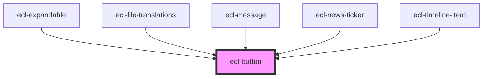

# ecl-button

<!-- Auto Generated Below -->

## Properties

| Property     | Attribute     | Description | Type     | Default     |
| ------------ | ------------- | ----------- | -------- | ----------- |
| `styleClass` | `style-class` |             | `string` | `''`        |
| `theme`      | `theme`       |             | `string` | `'ec'`      |
| `type`       | `type`        |             | `string` | `'primary'` |

## Dependencies

### Used by

 - [ecl-expandable](../ecl-expandable)
 - [ecl-file-translations](../ecl-file)
 - [ecl-message](../ecl-message)
 - [ecl-news-ticker](../ecl-news-ticker)
 - [ecl-timeline-item](../ecl-timeline)

### Graph

----------------------------------------------

*Built with [StencilJS](https://stenciljs.com/)*
