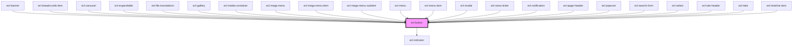

# ecl-button

<!-- Auto Generated Below -->

## Properties

| Property                | Attribute                 | Description | Type      | Default     |
| ----------------------- | ------------------------- | ----------- | --------- | ----------- |
| `ariaControls`          | `aria-controls`           |             | `string`  | `undefined` |
| `buttonStyle`           | `button-style`            |             | `string`  | `undefined` |
| `containerExtraClasses` | `container-extra-classes` |             | `string`  | `undefined` |
| `disabled`              | `disabled`                |             | `boolean` | `false`     |
| `hideLabel`             | `hide-label`              |             | `boolean` | `false`     |
| `indicator`             | `indicator`               |             | `boolean` | `false`     |
| `indicatorValue`        | `indicator-value`         |             | `string`  | `''`        |
| `itemId`                | `item-id`                 |             | `string`  | `undefined` |
| `size`                  | `size`                    |             | `string`  | `'l'`       |
| `styleClass`            | `style-class`             |             | `string`  | `''`        |
| `theme`                 | `theme`                   |             | `string`  | `undefined` |
| `type`                  | `type`                    |             | `string`  | `'submit'`  |
| `variant`               | `variant`                 |             | `string`  | `''`        |

## Dependencies

### Used by

 - [ecl-banner](../ecl-banner)
 - [ecl-breadcrumb-item](../ecl-breadcrumb)
 - [ecl-carousel](../ecl-carousel)
 - [ecl-expandable](../ecl-expandable)
 - [ecl-file-translations](../ecl-file)
 - [ecl-gallery](../ecl-gallery)
 - [ecl-media-container](../ecl-media-container)
 - [ecl-mega-menu](../ecl-mega-menu)
 - [ecl-mega-menu-item](../ecl-mega-menu)
 - [ecl-mega-menu-subitem](../ecl-mega-menu)
 - [ecl-menu](../ecl-menu)
 - [ecl-menu-item](../ecl-menu)
 - [ecl-modal](../ecl-modal)
 - [ecl-news-ticker](../ecl-news-ticker)
 - [ecl-notification](../ecl-notification)
 - [ecl-page-header](../ecl-page-header)
 - [ecl-popover](../ecl-popover)
 - [ecl-search-form](../ecl-search-form)
 - [ecl-select](../ecl-select)
 - [ecl-site-header](../ecl-site-header)
 - [ecl-tabs](../ecl-tabs)
 - [ecl-timeline-item](../ecl-timeline)

### Depends on

- [ecl-indicator](../ecl-indicator)

### Graph

```mermaid
graph TD;
  ecl-button --> ecl-indicator
  ecl-banner --> ecl-button
  ecl-breadcrumb-item --> ecl-button
  ecl-carousel --> ecl-button
  ecl-expandable --> ecl-button
  ecl-file-translations --> ecl-button
  ecl-gallery --> ecl-button
  ecl-media-container --> ecl-button
  ecl-mega-menu --> ecl-button
  ecl-mega-menu-item --> ecl-button
  ecl-mega-menu-subitem --> ecl-button
  ecl-menu --> ecl-button
  ecl-menu-item --> ecl-button
  ecl-modal --> ecl-button
  ecl-news-ticker --> ecl-button
  ecl-notification --> ecl-button
  ecl-page-header --> ecl-button
  ecl-popover --> ecl-button
  ecl-search-form --> ecl-button
  ecl-select --> ecl-button
  ecl-site-header --> ecl-button
  ecl-tabs --> ecl-button
  ecl-timeline-item --> ecl-button
  style ecl-button fill:#f9f,stroke:#333,stroke-width:4px
```

----------------------------------------------

*Built with [StencilJS](https://stenciljs.com/)*
