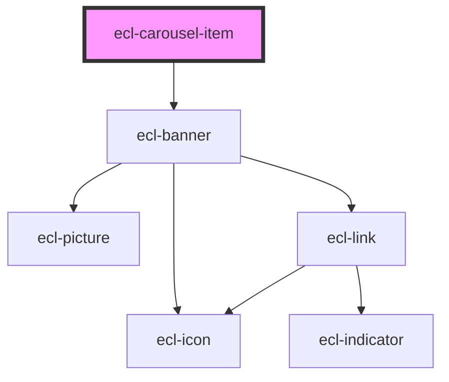

# ecl-carousel

<!-- Auto Generated Below -->

## Properties

| Property        | Attribute        | Description | Type      | Default     |
| --------------- | ---------------- | ----------- | --------- | ----------- |
| `ariaLabel`     | `aria-label`     |             | `string`  | `undefined` |
| `bannerTitle`   | `banner-title`   |             | `string`  | `''`        |
| `bannerVariant` | `banner-variant` |             | `string`  | `''`        |
| `centered`      | `centered`       |             | `boolean` | `undefined` |
| `ctaLabel`      | `cta-label`      |             | `string`  | `undefined` |
| `ctaLink`       | `cta-link`       |             | `string`  | `undefined` |
| `image`         | `image`          |             | `string`  | `''`        |
| `size`          | `size`           |             | `string`  | `'m'`       |
| `styleClass`    | `style-class`    |             | `string`  | `''`        |
| `theme`         | `theme`          |             | `string`  | `'ec'`      |

## Dependencies

### Depends on

- [ecl-banner](../ecl-banner)

### Graph

----------------------------------------------

*Built with [StencilJS](https://stenciljs.com/)*
