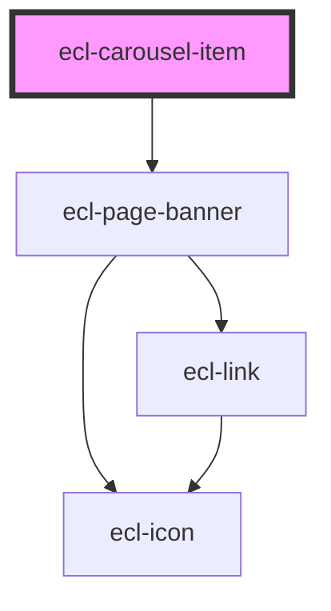

# ecl-carousel

<!-- Auto Generated Below -->

## Properties

| Property        | Attribute        | Description | Type     | Default     |
| --------------- | ---------------- | ----------- | -------- | ----------- |
| `ariaLabel`     | `aria-label`     |             | `string` | `undefined` |
| `bannerTitle`   | `banner-title`   |             | `string` | `''`        |
| `bannerVariant` | `banner-variant` |             | `string` | `''`        |
| `ctaLabel`      | `cta-label`      |             | `string` | `undefined` |
| `ctaLink`       | `cta-link`       |             | `string` | `undefined` |
| `image`         | `image`          |             | `string` | `''`        |
| `styleClass`    | `style-class`    |             | `string` | `''`        |
| `theme`         | `theme`          |             | `string` | `'ec'`      |

## Dependencies

### Depends on

- [ecl-page-banner](../ecl-page-banner)

### Graph

----------------------------------------------

*Built with [StencilJS](https://stenciljs.com/)*
