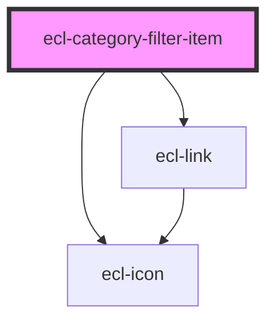

# ecl-category-filter-subitem

<!-- Auto Generated Below -->

## Properties

| Property      | Attribute     | Description | Type          | Default     |
| ------------- | ------------- | ----------- | ------------- | ----------- |
| `expanded`    | `expanded`    |             | `boolean`     | `false`     |
| `label`       | `label`       |             | `string`      | `undefined` |
| `lastClicked` | --            |             | `HTMLElement` | `undefined` |
| `level`       | `level`       |             | `number`      | `undefined` |
| `path`        | `path`        |             | `string`      | `undefined` |
| `styleClass`  | `style-class` |             | `string`      | `''`        |
| `subItems`    | `sub-items`   |             | `boolean`     | `false`     |
| `theme`       | `theme`       |             | `string`      | `'ec'`      |

## Dependencies

### Depends on

- [ecl-link](../ecl-link)
- [ecl-icon](../ecl-icon)

### Graph

----------------------------------------------

*Built with [StencilJS](https://stenciljs.com/)*
