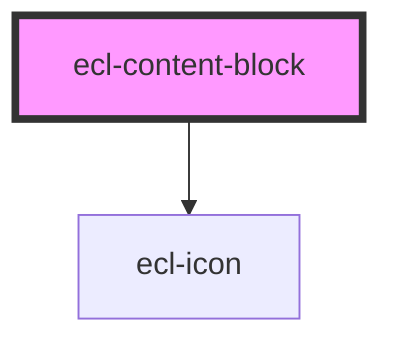

# ecl-content-block

<!-- Auto Generated Below -->

## Properties

| Property            | Attribute             | Description | Type      | Default     |
| ------------------- | --------------------- | ----------- | --------- | ----------- |
| `hasDescription`    | `has-description`     |             | `boolean` | `undefined` |
| `hasLabels`         | `has-labels`          |             | `boolean` | `undefined` |
| `hasLinks`          | `has-links`           |             | `boolean` | `undefined` |
| `hasLists`          | `has-lists`           |             | `boolean` | `undefined` |
| `hasSecondaryLinks` | `has-secondary-links` |             | `boolean` | `undefined` |
| `hasTitle`          | `has-title`           |             | `boolean` | `undefined` |
| `metaPrimary`       | `meta-primary`        |             | `string`  | `undefined` |
| `metaSecondary`     | `meta-secondary`      |             | `string`  | `undefined` |
| `styleClass`        | `style-class`         |             | `string`  | `''`        |
| `theme`             | `theme`               |             | `string`  | `'ec'`      |

## Dependencies

### Depends on

- [ecl-icon](../ecl-icon)

### Graph

----------------------------------------------

*Built with [StencilJS](https://stenciljs.com/)*
