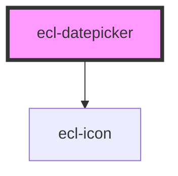

# ecl-datepicker

<!-- Auto Generated Below -->

## Properties

| Property       | Attribute       | Description | Type      | Default        |
| -------------- | --------------- | ----------- | --------- | -------------- |
| `dateFormat`   | `date-format`   |             | `string`  | `'DD-MM-YYYY'` |
| `defaultValue` | `default-value` |             | `string`  | `undefined`    |
| `disabled`     | `disabled`      |             | `boolean` | `false`        |
| `inputId`      | `input-id`      |             | `string`  | `undefined`    |
| `invalid`      | `invalid`       |             | `boolean` | `false`        |
| `name`         | `name`          |             | `string`  | `undefined`    |
| `placeholder`  | `placeholder`   |             | `string`  | `'DD-MM-YYYY'` |
| `required`     | `required`      |             | `boolean` | `false`        |
| `styleClass`   | `style-class`   |             | `string`  | `undefined`    |
| `theme`        | `theme`         |             | `string`  | `'ec'`         |
| `type`         | `type`          |             | `string`  | `undefined`    |
| `yearRange`    | `year-range`    |             | `number`  | `40`           |

## Events

| Event          | Description | Type                  |
| -------------- | ----------- | --------------------- |
| `blurred`      |             | `CustomEvent<void>`   |
| `focused`      |             | `CustomEvent<void>`   |
| `valueChanged` |             | `CustomEvent<string>` |

## Dependencies

### Depends on

- [ecl-icon](../ecl-icon)

### Graph

----------------------------------------------

*Built with [StencilJS](https://stenciljs.com/)*
