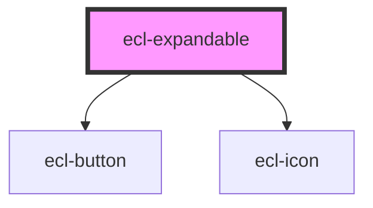

# ecl-expandable

<!-- Auto Generated Below -->

## Properties

| Property         | Attribute         | Description | Type      | Default     |
| ---------------- | ----------------- | ----------- | --------- | ----------- |
| `eclScript`      | `ecl-script`      |             | `boolean` | `undefined` |
| `isExpanded`     | `is-expanded`     |             | `boolean` | `undefined` |
| `labelCollapsed` | `label-collapsed` |             | `string`  | `undefined` |
| `labelExpanded`  | `label-expanded`  |             | `string`  | `undefined` |
| `styleClass`     | `style-class`     |             | `string`  | `undefined` |
| `theme`          | `theme`           |             | `string`  | `'ec'`      |
| `withUtils`      | `with-utils`      |             | `boolean` | `undefined` |

## Dependencies

### Depends on

- [ecl-button](../ecl-button)
- [ecl-icon](../ecl-icon)

### Graph

----------------------------------------------

*Built with [StencilJS](https://stenciljs.com/)*
