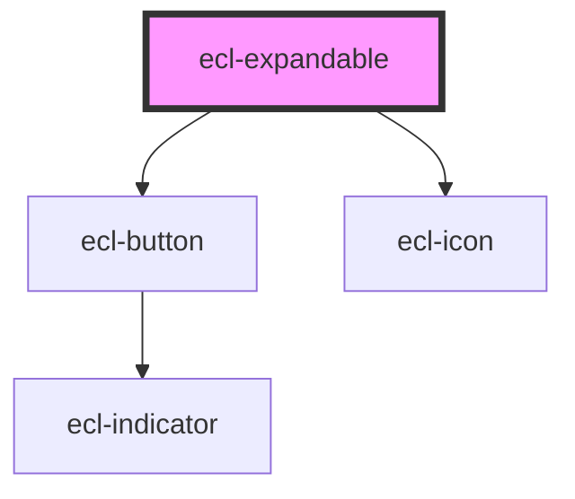

# ecl-expandable

<!-- Auto Generated Below -->

## Properties

| Property         | Attribute         | Description | Type      | Default                                                           |
| ---------------- | ----------------- | ----------- | --------- | ----------------------------------------------------------------- |
| `elId`           | `el-id`           |             | `string`  | `` `ecl-expandable-${Math.random().toString(36).substr(2, 9)}` `` |
| `isExpanded`     | `is-expanded`     |             | `boolean` | `false`                                                           |
| `labelCollapsed` | `label-collapsed` |             | `string`  | `''`                                                              |
| `labelExpanded`  | `label-expanded`  |             | `string`  | `''`                                                              |
| `noScript`       | `no-script`       |             | `boolean` | `false`                                                           |
| `styleClass`     | `style-class`     |             | `string`  | `''`                                                              |
| `theme`          | `theme`           |             | `string`  | `undefined`                                                       |

## Dependencies

### Depends on

- [ecl-button](../ecl-button)
- [ecl-icon](../ecl-icon)

### Graph

```mermaid
graph TD;
  ecl-expandable --> ecl-button
  ecl-expandable --> ecl-icon
  ecl-button --> ecl-indicator
  style ecl-expandable fill:#f9f,stroke:#333,stroke-width:4px
```

----------------------------------------------

*Built with [StencilJS](https://stenciljs.com/)*
