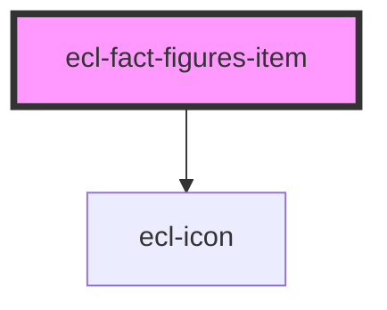

# ecl-fact-figures

<!-- Auto Generated Below -->

## Properties

| Property        | Attribute        | Description | Type     | Default     |
| --------------- | ---------------- | ----------- | -------- | ----------- |
| `icon`          | `icon`           |             | `string` | `undefined` |
| `iconTransform` | `icon-transform` |             | `string` | `undefined` |
| `itemTitle`     | `item-title`     |             | `string` | `undefined` |
| `styleClass`    | `style-class`    |             | `string` | `undefined` |
| `theme`         | `theme`          |             | `string` | `'ec'`      |
| `value`         | `value`          |             | `string` | `undefined` |

## Dependencies

### Depends on

- [ecl-icon](../ecl-icon)

### Graph

----------------------------------------------

*Built with [StencilJS](https://stenciljs.com/)*
