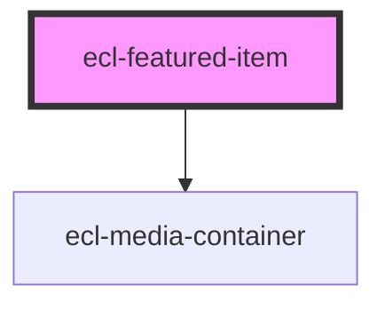

# ecl-featured-item

<!-- Auto Generated Below -->

## Properties

| Property                | Attribute                 | Description | Type      | Default                          |
| ----------------------- | ------------------------- | ----------- | --------- | -------------------------------- |
| `defaultContainerClass` | `default-container-class` |             | `string`  | `'ecl-featured-item__container'` |
| `eclScript`             | `ecl-script`              |             | `boolean` | `false`                          |
| `image`                 | `image`                   |             | `string`  | `undefined`                      |
| `itemTitle`             | `item-title`              |             | `string`  | `undefined`                      |
| `mediaCaption`          | `media-caption`           |             | `string`  | `undefined`                      |
| `position`              | `position`                |             | `string`  | `'left'`                         |
| `styleClass`            | `style-class`             |             | `string`  | `undefined`                      |
| `theme`                 | `theme`                   |             | `string`  | `'ec'`                           |
| `variant`               | `variant`                 |             | `string`  | `'default'`                      |
| `withUtils`             | `with-utils`              |             | `boolean` | `false`                          |

## Dependencies

### Depends on

- [ecl-media-container](../ecl-media-container)

### Graph

----------------------------------------------

*Built with [StencilJS](https://stenciljs.com/)*
