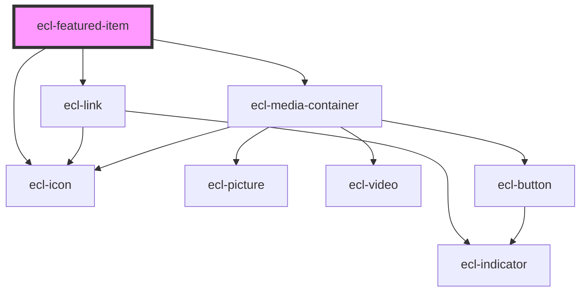

# ecl-featured-item

<!-- Auto Generated Below -->

## Properties

| Property                | Attribute                 | Description | Type     | Default                                                                                       |
| ----------------------- | ------------------------- | ----------- | -------- | --------------------------------------------------------------------------------------------- |
| `colorMode`             | `color-mode`              |             | `string` | `''`                                                                                          |
| `defaultContainerClass` | `default-container-class` |             | `string` | `'ecl-featured-item__container'`                                                              |
| `elId`                  | `el-id`                   |             | `string` | `` `ecl-featured-item-${Date.now().toString(16) + Math.random().toString(16).slice(2,10)}` `` |
| `image`                 | `image`                   |             | `string` | `undefined`                                                                                   |
| `itemTitle`             | `item-title`              |             | `string` | `undefined`                                                                                   |
| `linkLabel`             | `link-label`              |             | `string` | `undefined`                                                                                   |
| `linkPath`              | `link-path`               |             | `string` | `undefined`                                                                                   |
| `linkType`              | `link-type`               |             | `string` | `undefined`                                                                                   |
| `mediaAnchor`           | `media-anchor`            |             | `string` | `undefined`                                                                                   |
| `mediaBehavior`         | `media-behavior`          |             | `string` | `undefined`                                                                                   |
| `mediaCaption`          | `media-caption`           |             | `string` | `undefined`                                                                                   |
| `position`              | `position`                |             | `string` | `'left'`                                                                                      |
| `styleClass`            | `style-class`             |             | `string` | `undefined`                                                                                   |
| `theme`                 | `theme`                   |             | `string` | `undefined`                                                                                   |
| `variant`               | `variant`                 |             | `string` | `'default'`                                                                                   |
| `verticalAlignment`     | `vertical-alignment`      |             | `string` | `'top'`                                                                                       |

## Dependencies

### Depends on

- [ecl-link](../ecl-link)
- [ecl-icon](../ecl-icon)
- [ecl-media-container](../ecl-media-container)

### Graph

```mermaid
graph TD;
  ecl-featured-item --> ecl-link
  ecl-featured-item --> ecl-icon
  ecl-featured-item --> ecl-media-container
  ecl-link --> ecl-icon
  ecl-link --> ecl-indicator
  ecl-media-container --> ecl-picture
  ecl-media-container --> ecl-video
  ecl-media-container --> ecl-button
  ecl-media-container --> ecl-icon
  ecl-button --> ecl-indicator
  style ecl-featured-item fill:#f9f,stroke:#333,stroke-width:4px
```

----------------------------------------------

*Built with [StencilJS](https://stenciljs.com/)*
