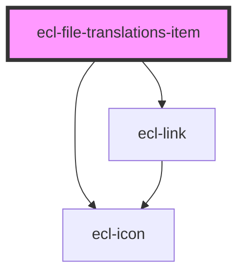

# ecl-file

<!-- Auto Generated Below -->

## Properties

| Property        | Attribute        | Description | Type     | Default     |
| --------------- | ---------------- | ----------- | -------- | ----------- |
| `downloadLabel` | `download-label` |             | `string` | `undefined` |
| `downloadLink`  | `download-link`  |             | `string` | `undefined` |
| `fileTitle`     | `file-title`     |             | `string` | `undefined` |
| `language`      | `language`       |             | `string` | `undefined` |
| `meta`          | `meta`           |             | `string` | `undefined` |
| `styleClass`    | `style-class`    |             | `string` | `undefined` |
| `theme`         | `theme`          |             | `string` | `'ec'`      |
| `variant`       | `variant`        |             | `string` | `'default'` |

## Dependencies

### Depends on

- [ecl-link](../ecl-link)
- [ecl-icon](../ecl-icon)

### Graph

----------------------------------------------

*Built with [StencilJS](https://stenciljs.com/)*
