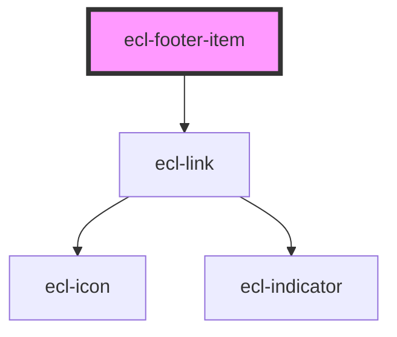

# ecl-footer

<!-- Auto Generated Below -->

## Properties

| Property     | Attribute     | Description | Type      | Default     |
| ------------ | ------------- | ----------- | --------- | ----------- |
| `ariaLabel`  | `aria-label`  |             | `string`  | `undefined` |
| `isFirst`    | `is-first`    |             | `boolean` | `false`     |
| `isLast`     | `is-last`     |             | `boolean` | `false`     |
| `link`       | `link`        |             | `string`  | `undefined` |
| `styleClass` | `style-class` |             | `string`  | `undefined` |
| `theme`      | `theme`       |             | `string`  | `undefined` |

## Dependencies

### Depends on

- [ecl-link](../ecl-link)

### Graph

----------------------------------------------

*Built with [StencilJS](https://stenciljs.com/)*
