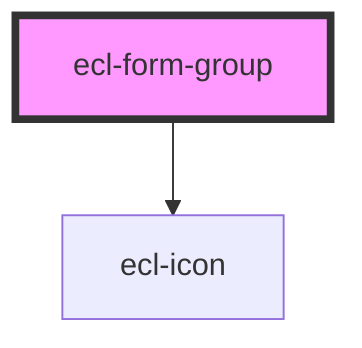

# ecl-form-group

<!-- Auto Generated Below -->

## Properties

| Property       | Attribute       | Description | Type      | Default     |
| -------------- | --------------- | ----------- | --------- | ----------- |
| `helperId`     | `helper-id`     |             | `string`  | `undefined` |
| `helperText`   | `helper-text`   |             | `string`  | `undefined` |
| `invalid`      | `invalid`       |             | `boolean` | `false`     |
| `invalidIcon`  | `invalid-icon`  |             | `string`  | `undefined` |
| `invalidText`  | `invalid-text`  |             | `string`  | `undefined` |
| `label`        | `label`         |             | `string`  | `undefined` |
| `name`         | `name`          |             | `string`  | `undefined` |
| `optionalText` | `optional-text` |             | `string`  | `undefined` |
| `required`     | `required`      |             | `boolean` | `false`     |
| `requiredText` | `required-text` |             | `string`  | `'*'`       |
| `styleClass`   | `style-class`   |             | `string`  | `''`        |
| `theme`        | `theme`         |             | `string`  | `'ec'`      |

## Dependencies

### Depends on

- [ecl-icon](../ecl-icon)

### Graph

----------------------------------------------

*Built with [StencilJS](https://stenciljs.com/)*
