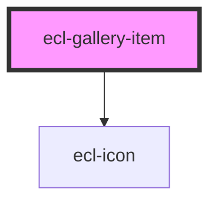

# ecl-gallery-item

<!-- Auto Generated Below -->

## Properties

| Property          | Attribute           | Description | Type     | Default     |
| ----------------- | ------------------- | ----------- | -------- | ----------- |
| `icon`            | `icon`              |             | `string` | `'video'`   |
| `imageAlt`        | `image-alt`         |             | `string` | `undefined` |
| `mediaHref`       | `media-href`        |             | `string` | `undefined` |
| `mediaIframeHref` | `media-iframe-href` |             | `string` | `undefined` |
| `mediaSharePath`  | `media-share-path`  |             | `string` | `undefined` |
| `meta`            | `meta`              |             | `string` | `undefined` |
| `styleClass`      | `style-class`       |             | `string` | `''`        |
| `theme`           | `theme`             |             | `string` | `'ec'`      |
| `type`            | `type`              |             | `string` | `'image'`   |

## Dependencies

### Depends on

- [ecl-icon](../ecl-icon)

### Graph

----------------------------------------------

*Built with [StencilJS](https://stenciljs.com/)*
