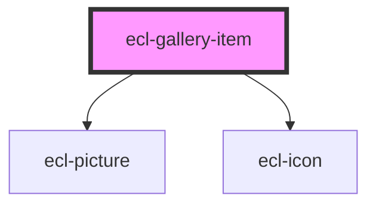

# ecl-gallery-item

<!-- Auto Generated Below -->

## Properties

| Property          | Attribute           | Description | Type      | Default     |
| ----------------- | ------------------- | ----------- | --------- | ----------- |
| `elId`            | `el-id`             |             | `string`  | `undefined` |
| `icon`            | `icon`              |             | `string`  | `undefined` |
| `imageAlt`        | `image-alt`         |             | `string`  | `undefined` |
| `mediaHref`       | `media-href`        |             | `string`  | `undefined` |
| `mediaIframeHref` | `media-iframe-href` |             | `string`  | `undefined` |
| `mediaSharePath`  | `media-share-path`  |             | `string`  | `undefined` |
| `meta`            | `meta`              |             | `string`  | `undefined` |
| `styleClass`      | `style-class`       |             | `string`  | `''`        |
| `theme`           | `theme`             |             | `string`  | `undefined` |
| `thumbZoom`       | `thumb-zoom`        |             | `boolean` | `false`     |
| `thumbnail`       | `thumbnail`         |             | `string`  | `undefined` |
| `type`            | `type`              |             | `string`  | `'image'`   |

## Dependencies

### Depends on

- [ecl-picture](../ecl-picture)
- [ecl-icon](../ecl-icon)

### Graph

```mermaid
graph TD;
  ecl-gallery-item --> ecl-picture
  ecl-gallery-item --> ecl-icon
  style ecl-gallery-item fill:#f9f,stroke:#333,stroke-width:4px
```

----------------------------------------------

*Built with [StencilJS](https://stenciljs.com/)*
