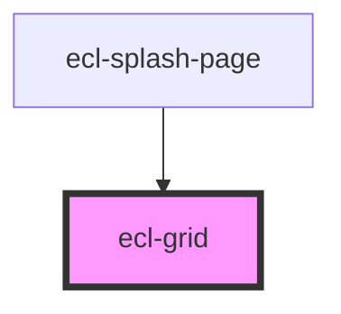

# ecl-grid

<!-- Auto Generated Below -->

## Properties

| Property     | Attribute     | Description | Type      | Default     |
| ------------ | ------------- | ----------- | --------- | ----------- |
| `breakpoint` | `breakpoint`  |             | `string`  | `undefined` |
| `columns`    | `columns`     |             | `number`  | `12`        |
| `container`  | `container`   |             | `boolean` | `false`     |
| `row`        | `row`         |             | `boolean` | `false`     |
| `styleClass` | `style-class` |             | `string`  | `''`        |
| `theme`      | `theme`       |             | `string`  | `'ec'`      |

## Dependencies

### Used by

 - [ecl-splash-page](../ecl-splash-page)

### Graph

----------------------------------------------

*Built with [StencilJS](https://stenciljs.com/)*
