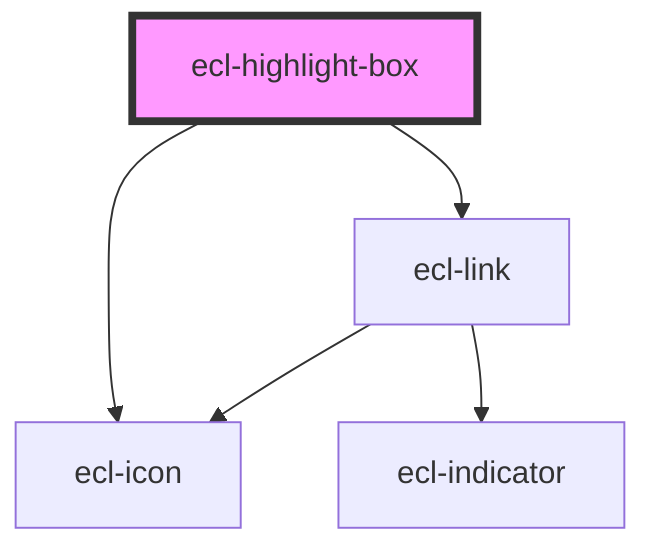

# ecl-highlight-box

<!-- Auto Generated Below -->

## Properties

| Property         | Attribute         | Description | Type      | Default                                                              |
| ---------------- | ----------------- | ----------- | --------- | -------------------------------------------------------------------- |
| `colorMode`      | `color-mode`      |             | `string`  | `''`                                                                 |
| `hasDescription` | `has-description` |             | `boolean` | `true`                                                               |
| `itemId`         | `item-id`         |             | `string`  | `` `ecl-highlight-box-${Math.random().toString(36).substr(2, 9)}` `` |
| `itemTitle`      | `item-title`      |             | `string`  | `''`                                                                 |
| `linkIcon`       | `link-icon`       |             | `string`  | `''`                                                                 |
| `linkLabel`      | `link-label`      |             | `string`  | `''`                                                                 |
| `linkPath`       | `link-path`       |             | `string`  | `''`                                                                 |
| `styleClass`     | `style-class`     |             | `string`  | `''`                                                                 |
| `theme`          | `theme`           |             | `string`  | `undefined`                                                          |
| `titleIcon`      | `title-icon`      |             | `string`  | `''`                                                                 |

## Dependencies

### Depends on

- [ecl-icon](../ecl-icon)
- [ecl-link](../ecl-link)

### Graph

----------------------------------------------

*Built with [StencilJS](https://stenciljs.com/)*
