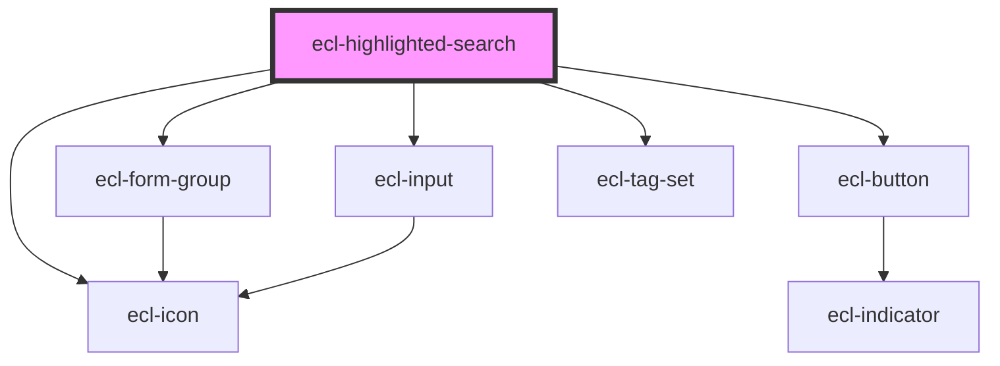

# ecl-highlighted-search

<!-- Auto Generated Below -->

## Properties

| Property          | Attribute          | Description | Type      | Default                                                                      |
| ----------------- | ------------------ | ----------- | --------- | ---------------------------------------------------------------------------- |
| `colorMode`       | `color-mode`       |             | `string`  | `''`                                                                         |
| `elId`            | `el-id`            |             | `string`  | `` `ecl-highlighted-search-${Math.random().toString(36).substring(2, 9)}` `` |
| `elTitle`         | `el-title`         |             | `string`  | `''`                                                                         |
| `formAttrs`       | `form-attrs`       |             | `string`  | `''`                                                                         |
| `hasDescription`  | `has-description`  |             | `boolean` | `false`                                                                      |
| `helperText`      | `helper-text`      |             | `string`  | `''`                                                                         |
| `inputAttrs`      | `input-attrs`      |             | `string`  | `''`                                                                         |
| `inputId`         | `input-id`         |             | `string`  | `` `${this.elId}-input` ``                                                   |
| `inputLabel`      | `input-label`      |             | `string`  | `''`                                                                         |
| `inputName`       | `input-name`       |             | `string`  | `'highlighted-search-input-name'`                                            |
| `styleClass`      | `style-class`      |             | `string`  | `''`                                                                         |
| `submitLabel`     | `submit-label`     |             | `string`  | `''`                                                                         |
| `suggestionLabel` | `suggestion-label` |             | `string`  | `''`                                                                         |
| `theme`           | `theme`            |             | `string`  | `undefined`                                                                  |

## Dependencies

### Depends on

- [ecl-icon](../ecl-icon)
- [ecl-form-group](../ecl-form-group)
- [ecl-input](../ecl-input)
- [ecl-button](../ecl-button)
- [ecl-tag-set](../ecl-tag)

### Graph

----------------------------------------------

*Built with [StencilJS](https://stenciljs.com/)*
