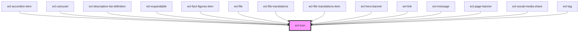

# ecl-icon

<!-- Auto Generated Below -->

## Properties

| Property     | Attribute     | Description | Type     | Default     |
| ------------ | ------------- | ----------- | -------- | ----------- |
| `color`      | `color`       |             | `string` | `''`        |
| `icon`       | `icon`        |             | `string` | `''`        |
| `path`       | `path`        |             | `string` | `undefined` |
| `size`       | `size`        |             | `string` | `'xs'`      |
| `sprite`     | `sprite`      |             | `string` | `''`        |
| `styleClass` | `style-class` |             | `string` | `''`        |
| `theme`      | `theme`       |             | `string` | `'ec'`      |
| `transform`  | `transform`   |             | `string` | `''`        |

## Dependencies

### Used by

 - [ecl-accordion-item](../ecl-accordion)
 - [ecl-carousel](../ecl-carousel)
 - [ecl-description-list-definition](../ecl-description-list)
 - [ecl-expandable](../ecl-expandable)
 - [ecl-fact-figures-item](../ecl-fact-figures)
 - [ecl-file](../ecl-file)
 - [ecl-file-translations](../ecl-file)
 - [ecl-file-translations-item](../ecl-file)
 - [ecl-hero-banner](../ecl-hero-banner)
 - [ecl-link](../ecl-link)
 - [ecl-message](../ecl-message)
 - [ecl-page-banner](../ecl-page-banner)
 - [ecl-social-media-share](../ecl-social-media-share)
 - [ecl-tag](../ecl-tag)

### Graph

----------------------------------------------

*Built with [StencilJS](https://stenciljs.com/)*
