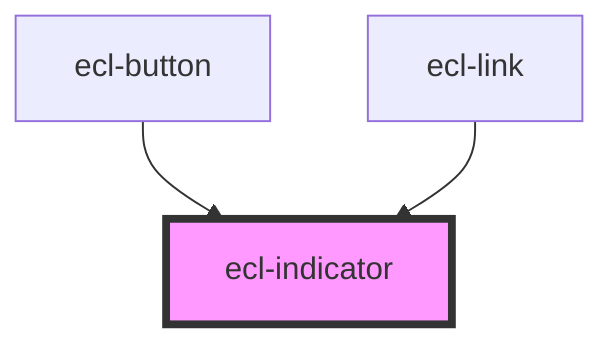

# ecl-indicator

<!-- Auto Generated Below -->

## Properties

| Property     | Attribute     | Description | Type      | Default |
| ------------ | ------------- | ----------- | --------- | ------- |
| `eclScript`  | `ecl-script`  |             | `boolean` | `false` |
| `styleClass` | `style-class` |             | `string`  | `''`    |
| `value`      | `value`       |             | `string`  | `''`    |

## Dependencies

### Used by

 - [ecl-button](../ecl-button)
 - [ecl-link](../ecl-link)

### Graph

----------------------------------------------

*Built with [StencilJS](https://stenciljs.com/)*
