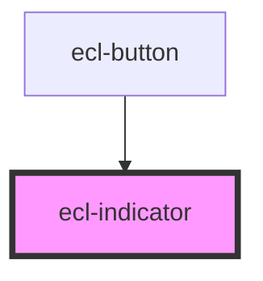

# ecl-indicator

<!-- Auto Generated Below -->

## Properties

| Property       | Attribute       | Description | Type      | Default |
| -------------- | --------------- | ----------- | --------- | ------- |
| `eclScript`    | `ecl-script`    |             | `boolean` | `false` |
| `extraClasses` | `extra-classes` |             | `string`  | `''`    |
| `value`        | `value`         |             | `string`  | `''`    |

## Dependencies

### Used by

 - [ecl-button](../ecl-button)

### Graph

----------------------------------------------

*Built with [StencilJS](https://stenciljs.com/)*
