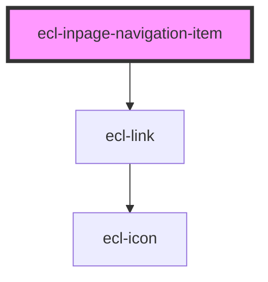

# ecl-inpage-navigation

<!-- Auto Generated Below -->

## Properties

| Property     | Attribute     | Description | Type     | Default     |
| ------------ | ------------- | ----------- | -------- | ----------- |
| `path`       | `path`        |             | `string` | `undefined` |
| `styleClass` | `style-class` |             | `string` | `undefined` |
| `theme`      | `theme`       |             | `string` | `'ec'`      |

## Dependencies

### Depends on

- [ecl-link](../ecl-link)

### Graph

----------------------------------------------

*Built with [StencilJS](https://stenciljs.com/)*
