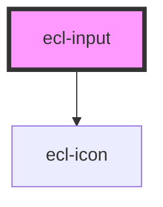

# ecl-input

<!-- Auto Generated Below -->

## Properties

| Property             | Attribute              | Description | Type      | Default     |
| -------------------- | ---------------------- | ----------- | --------- | ----------- |
| `buttonChooseLabel`  | `button-choose-label`  |             | `string`  | `undefined` |
| `buttonReplaceLabel` | `button-replace-label` |             | `string`  | `undefined` |
| `defaultValue`       | `default-value`        |             | `string`  | `undefined` |
| `disabled`           | `disabled`             |             | `boolean` | `false`     |
| `eclScript`          | `ecl-script`           |             | `boolean` | `false`     |
| `helperId`           | `helper-id`            |             | `string`  | `undefined` |
| `helperText`         | `helper-text`          |             | `string`  | `undefined` |
| `inputId`            | `input-id`             |             | `string`  | `undefined` |
| `invalid`            | `invalid`              |             | `boolean` | `false`     |
| `label`              | `label`                |             | `string`  | `undefined` |
| `max`                | `max`                  |             | `number`  | `undefined` |
| `min`                | `min`                  |             | `number`  | `undefined` |
| `multiple`           | `multiple`             |             | `boolean` | `false`     |
| `name`               | `name`                 |             | `string`  | `undefined` |
| `placeholder`        | `placeholder`          |             | `string`  | `undefined` |
| `required`           | `required`             |             | `boolean` | `false`     |
| `step`               | `step`                 |             | `number`  | `1`         |
| `styleClass`         | `style-class`          |             | `string`  | `undefined` |
| `theme`              | `theme`                |             | `string`  | `'ec'`      |
| `type`               | `type`                 |             | `string`  | `undefined` |
| `valueLabel`         | `value-label`          |             | `string`  | `undefined` |
| `width`              | `width`                |             | `string`  | `'m'`       |
| `withUtils`          | `with-utils`           |             | `boolean` | `false`     |

## Dependencies

### Depends on

- [ecl-icon](../ecl-icon)

### Graph

----------------------------------------------

*Built with [StencilJS](https://stenciljs.com/)*
