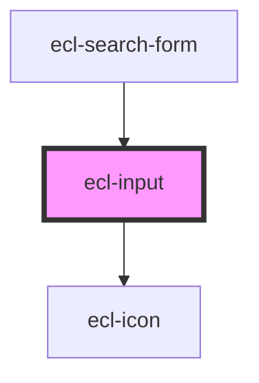

# ecl-input

<!-- Auto Generated Below -->

## Properties

| Property       | Attribute       | Description | Type      | Default     |
| -------------- | --------------- | ----------- | --------- | ----------- |
| `defaultValue` | `default-value` |             | `string`  | `undefined` |
| `disabled`     | `disabled`      |             | `boolean` | `false`     |
| `eclScript`    | `ecl-script`    |             | `boolean` | `false`     |
| `hasChanged`   | `has-changed`   |             | `boolean` | `false`     |
| `helperText`   | `helper-text`   |             | `string`  | `undefined` |
| `inputClass`   | `input-class`   |             | `string`  | `undefined` |
| `inputId`      | `input-id`      |             | `string`  | `undefined` |
| `invalid`      | `invalid`       |             | `boolean` | `false`     |
| `isFocused`    | `is-focused`    |             | `boolean` | `false`     |
| `label`        | `label`         |             | `string`  | `undefined` |
| `name`         | `name`          |             | `string`  | `undefined` |
| `placeholder`  | `placeholder`   |             | `string`  | `undefined` |
| `required`     | `required`      |             | `boolean` | `false`     |
| `styleClass`   | `style-class`   |             | `string`  | `undefined` |
| `theme`        | `theme`         |             | `string`  | `'ec'`      |
| `type`         | `type`          |             | `string`  | `undefined` |
| `width`        | `width`         |             | `string`  | `'m'`       |

## Events

| Event         | Description | Type                      |
| ------------- | ----------- | ------------------------- |
| `inputBlur`   |             | `CustomEvent<FocusEvent>` |
| `inputChange` |             | `CustomEvent<any>`        |
| `inputFocus`  |             | `CustomEvent<FocusEvent>` |

## Dependencies

### Used by

 - [ecl-search-form](../ecl-search-form)

### Depends on

- [ecl-icon](../ecl-icon)

### Graph

----------------------------------------------

*Built with [StencilJS](https://stenciljs.com/)*
