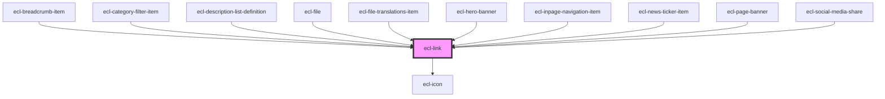

# ecl-link

<!-- Auto Generated Below -->

## Properties

| Property     | Attribute     | Description | Type      | Default     |
| ------------ | ------------- | ----------- | --------- | ----------- |
| `external`   | `external`    |             | `boolean` | `false`     |
| `path`       | `path`        |             | `string`  | `undefined` |
| `styleClass` | `style-class` |             | `string`  | `undefined` |
| `theme`      | `theme`       |             | `string`  | `'ec'`      |
| `titleAttr`  | `title-attr`  |             | `string`  | `undefined` |
| `variant`    | `variant`     |             | `string`  | `'default'` |

## Dependencies

### Used by

 - [ecl-breadcrumb-item](../ecl-breadcrumb)
 - [ecl-category-filter-item](../ecl-category-filter)
 - [ecl-description-list-definition](../ecl-description-list)
 - [ecl-file](../ecl-file)
 - [ecl-file-translations-item](../ecl-file)
 - [ecl-hero-banner](../ecl-hero-banner)
 - [ecl-inpage-navigation-item](../ecl-inpage-navigation)
 - [ecl-news-ticker-item](../ecl-news-ticker)
 - [ecl-page-banner](../ecl-page-banner)
 - [ecl-social-media-share](../ecl-social-media-share)

### Depends on

- [ecl-icon](../ecl-icon)

### Graph

----------------------------------------------

*Built with [StencilJS](https://stenciljs.com/)*
