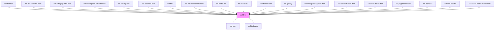

# ecl-link

<!-- Auto Generated Below -->

## Properties

| Property         | Attribute         | Description | Type      | Default     |
| ---------------- | ----------------- | ----------- | --------- | ----------- |
| `ariaLabel`      | `aria-label`      |             | `string`  | `undefined` |
| `branded`        | `branded`         |             | `boolean` | `false`     |
| `download`       | `download`        |             | `boolean` | `false`     |
| `external`       | `external`        |             | `boolean` | `false`     |
| `hideLabel`      | `hide-label`      |             | `boolean` | `false`     |
| `indicator`      | `indicator`       |             | `boolean` | `false`     |
| `indicatorValue` | `indicator-value` |             | `string`  | `undefined` |
| `inverted`       | `inverted`        |             | `boolean` | `false`     |
| `name`           | `name`            |             | `string`  | `undefined` |
| `noVisited`      | `no-visited`      |             | `boolean` | `false`     |
| `path`           | `path`            |             | `string`  | `undefined` |
| `srExternal`     | `sr-external`     |             | `string`  | `undefined` |
| `styleClass`     | `style-class`     |             | `string`  | `undefined` |
| `target`         | `target`          |             | `string`  | `undefined` |
| `theme`          | `theme`           |             | `string`  | `undefined` |
| `titleAttr`      | `title-attr`      |             | `string`  | `undefined` |
| `variant`        | `variant`         |             | `string`  | `''`        |

## Dependencies

### Used by

 - [ecl-banner](../ecl-banner)
 - [ecl-breadcrumb-item](../ecl-breadcrumb)
 - [ecl-category-filter-item](../ecl-category-filter)
 - [ecl-description-list-definition](../ecl-description-list)
 - [ecl-fact-figures](../ecl-fact-figures)
 - [ecl-featured-item](../ecl-featured-item)
 - [ecl-file](../ecl-file)
 - [ecl-file-translations-item](../ecl-file)
 - [ecl-footer-ec](../ecl-footer)
 - [ecl-footer-eu](../ecl-footer)
 - [ecl-footer-item](../ecl-footer)
 - [ecl-gallery](../ecl-gallery)
 - [ecl-inpage-navigation-item](../ecl-inpage-navigation)
 - [ecl-list-illustration-item](../ecl-list-illustration)
 - [ecl-news-ticker-item](../ecl-news-ticker)
 - [ecl-pagination-item](../ecl-pagination)
 - [ecl-popover](../ecl-popover)
 - [ecl-site-header](../ecl-site-header)
 - [ecl-social-media-follow-item](../ecl-social-media-follow)

### Depends on

- [ecl-icon](../ecl-icon)
- [ecl-indicator](../ecl-indicator)

### Graph

```mermaid
graph TD;
  ecl-link --> ecl-icon
  ecl-link --> ecl-indicator
  ecl-banner --> ecl-link
  ecl-breadcrumb-item --> ecl-link
  ecl-category-filter-item --> ecl-link
  ecl-description-list-definition --> ecl-link
  ecl-fact-figures --> ecl-link
  ecl-featured-item --> ecl-link
  ecl-file --> ecl-link
  ecl-file-translations-item --> ecl-link
  ecl-footer-ec --> ecl-link
  ecl-footer-eu --> ecl-link
  ecl-footer-item --> ecl-link
  ecl-gallery --> ecl-link
  ecl-inpage-navigation-item --> ecl-link
  ecl-list-illustration-item --> ecl-link
  ecl-news-ticker-item --> ecl-link
  ecl-pagination-item --> ecl-link
  ecl-popover --> ecl-link
  ecl-site-header --> ecl-link
  ecl-social-media-follow-item --> ecl-link
  style ecl-link fill:#f9f,stroke:#333,stroke-width:4px
```

----------------------------------------------

*Built with [StencilJS](https://stenciljs.com/)*
