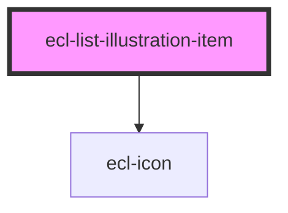

# ecl-list-illustration

<!-- Auto Generated Below -->

## Properties

| Property      | Attribute      | Description | Type      | Default     |
| ------------- | -------------- | ----------- | --------- | ----------- |
| `icon`        | `icon`         |             | `string`  | `undefined` |
| `image`       | `image`        |             | `string`  | `undefined` |
| `imageAlt`    | `image-alt`    |             | `string`  | `undefined` |
| `itemTitle`   | `item-title`   |             | `string`  | `undefined` |
| `squareImage` | `square-image` |             | `boolean` | `false`     |
| `styleClass`  | `style-class`  |             | `string`  | `undefined` |
| `theme`       | `theme`        |             | `string`  | `'ec'`      |

## Dependencies

### Depends on

- [ecl-icon](../ecl-icon)

### Graph

----------------------------------------------

*Built with [StencilJS](https://stenciljs.com/)*
