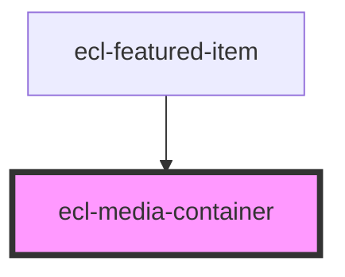

# ecl-media-container

<!-- Auto Generated Below -->

## Properties

| Property        | Attribute        | Description | Type      | Default     |
| --------------- | ---------------- | ----------- | --------- | ----------- |
| `alt`           | `alt`            |             | `string`  | `undefined` |
| `description`   | `description`    |             | `string`  | `undefined` |
| `eclScript`     | `ecl-script`     |             | `boolean` | `false`     |
| `embeddedMedia` | `embedded-media` |             | `boolean` | `false`     |
| `fullWidth`     | `full-width`     |             | `boolean` | `false`     |
| `image`         | `image`          |             | `string`  | `undefined` |
| `ratio`         | `ratio`          |             | `string`  | `'16-9'`    |
| `sources`       | `sources`        |             | `string`  | `undefined` |
| `styleClass`    | `style-class`    |             | `string`  | `undefined` |
| `theme`         | `theme`          |             | `string`  | `'ec'`      |
| `tracks`        | `tracks`         |             | `string`  | `undefined` |
| `withUtils`     | `with-utils`     |             | `boolean` | `false`     |

## Dependencies

### Used by

 - [ecl-featured-item](../ecl-featured-item)

### Graph

----------------------------------------------

*Built with [StencilJS](https://stenciljs.com/)*
