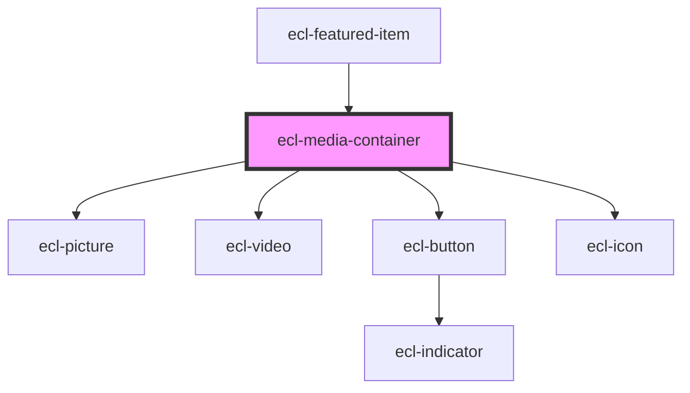

# ecl-media-container

<!-- Auto Generated Below -->

## Properties

| Property        | Attribute         | Description | Type      | Default     |
| --------------- | ----------------- | ----------- | --------- | ----------- |
| `autoplay`      | `autoplay`        |             | `boolean` | `false`     |
| `eclScript`     | `ecl-script`      |             | `boolean` | `true`      |
| `embeddedMedia` | `embedded-media`  |             | `boolean` | `false`     |
| `fullWidth`     | `full-width`      |             | `boolean` | `false`     |
| `hasCaption`    | `has-caption`     |             | `boolean` | `false`     |
| `image`         | `image`           |             | `string`  | `undefined` |
| `imageAlt`      | `image-alt`       |             | `string`  | `undefined` |
| `imageAnchor`   | `image-anchor`    |             | `string`  | `'center'`  |
| `ratio`         | `ratio`           |             | `string`  | `''`        |
| `sources`       | `sources`         |             | `string`  | `undefined` |
| `srPause`       | `sr-pause`        |             | `string`  | `undefined` |
| `srPlay`        | `sr-play`         |             | `string`  | `undefined` |
| `srVideoAudio`  | `sr-video-audio`  |             | `string`  | `undefined` |
| `srVideoPlayer` | `sr-video-player` |             | `string`  | `undefined` |
| `styleClass`    | `style-class`     |             | `string`  | `undefined` |
| `theme`         | `theme`           |             | `string`  | `undefined` |
| `tracks`        | `tracks`          |             | `string`  | `undefined` |

## Dependencies

### Used by

 - [ecl-featured-item](../ecl-featured-item)

### Depends on

- [ecl-picture](../ecl-picture)
- [ecl-video](../ecl-video)
- [ecl-button](../ecl-button)
- [ecl-icon](../ecl-icon)

### Graph

```mermaid
graph TD;
  ecl-media-container --> ecl-picture
  ecl-media-container --> ecl-video
  ecl-media-container --> ecl-button
  ecl-media-container --> ecl-icon
  ecl-button --> ecl-indicator
  ecl-featured-item --> ecl-media-container
  style ecl-media-container fill:#f9f,stroke:#333,stroke-width:4px
```

----------------------------------------------

*Built with [StencilJS](https://stenciljs.com/)*
