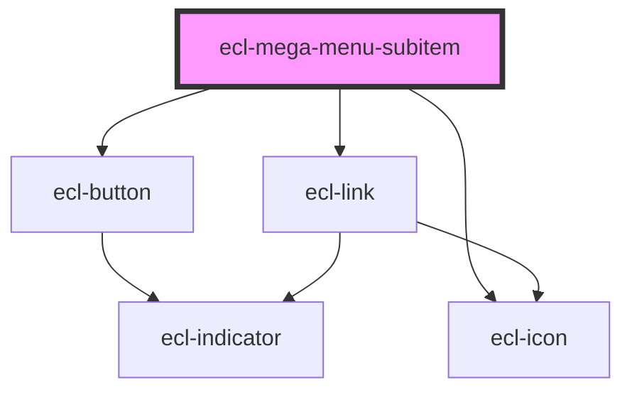

# ecl-mega-menu-item

<!-- Auto Generated Below -->

## Properties

| Property             | Attribute        | Description | Type      | Default     |
| -------------------- | ---------------- | ----------- | --------- | ----------- |
| `external`           | `external`       |             | `boolean` | `false`     |
| `featuredTitle`      | `featured-title` |             | `string`  | `undefined` |
| `hasChildren`        | `has-children`   |             | `boolean` | `false`     |
| `hasFeatured`        | `has-featured`   |             | `boolean` | `false`     |
| `label` _(required)_ | `label`          |             | `string`  | `undefined` |
| `oneLevelOnly`       | `one-level-only` |             | `boolean` | `false`     |
| `path`               | `path`           |             | `string`  | `undefined` |
| `seeAll`             | `see-all`        |             | `boolean` | `false`     |
| `seeAllLabel`        | `see-all-label`  |             | `string`  | `undefined` |
| `styleClass`         | `style-class`    |             | `string`  | `undefined` |
| `theme`              | `theme`          |             | `string`  | `undefined` |

## Dependencies

### Depends on

- [ecl-button](../ecl-button)
- [ecl-icon](../ecl-icon)
- [ecl-link](../ecl-link)

### Graph

----------------------------------------------

*Built with [StencilJS](https://stenciljs.com/)*
