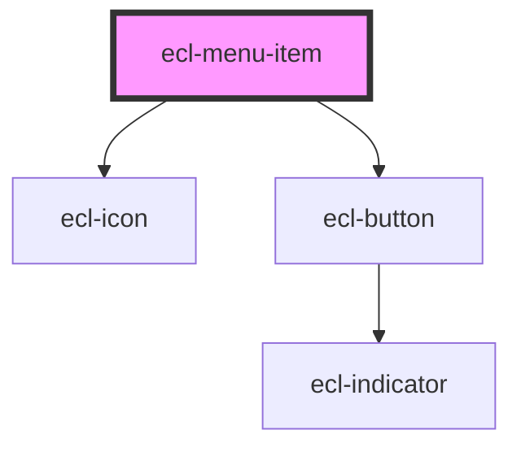

# ecl-menu

<!-- Auto Generated Below -->

## Properties

| Property           | Attribute            | Description | Type      | Default     |
| ------------------ | -------------------- | ----------- | --------- | ----------- |
| `child`            | `child`              |             | `boolean` | `false`     |
| `current`          | `current`            |             | `boolean` | `false`     |
| `external`         | `external`           |             | `boolean` | `false`     |
| `hasChildren`      | `has-children`       |             | `boolean` | `false`     |
| `link`             | `link`               |             | `string`  | `undefined` |
| `styleClass`       | `style-class`        |             | `string`  | `undefined` |
| `theme`            | `theme`              |             | `string`  | `'ec'`      |
| `triggerAriaLabel` | `trigger-aria-label` |             | `string`  | `undefined` |

## Dependencies

### Depends on

- [ecl-icon](../ecl-icon)
- [ecl-button](../ecl-button)

### Graph

----------------------------------------------

*Built with [StencilJS](https://stenciljs.com/)*
