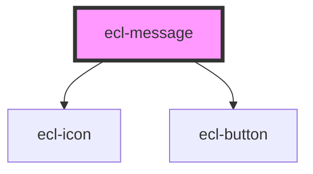

# ecl-message

<!-- Auto Generated Below -->

## Properties

| Property       | Attribute       | Description | Type      | Default     |
| -------------- | --------------- | ----------- | --------- | ----------- |
| `closeLabel`   | `close-label`   |             | `string`  | `undefined` |
| `eclScript`    | `ecl-script`    |             | `boolean` | `false`     |
| `messageTitle` | `message-title` |             | `string`  | `undefined` |
| `styleClass`   | `style-class`   |             | `string`  | `undefined` |
| `theme`        | `theme`         |             | `string`  | `'ec'`      |
| `variant`      | `variant`       |             | `string`  | `'info'`    |
| `withUtils`    | `with-utils`    |             | `boolean` | `false`     |

## Dependencies

### Depends on

- [ecl-icon](../ecl-icon)
- [ecl-button](../ecl-button)

### Graph

----------------------------------------------

*Built with [StencilJS](https://stenciljs.com/)*
