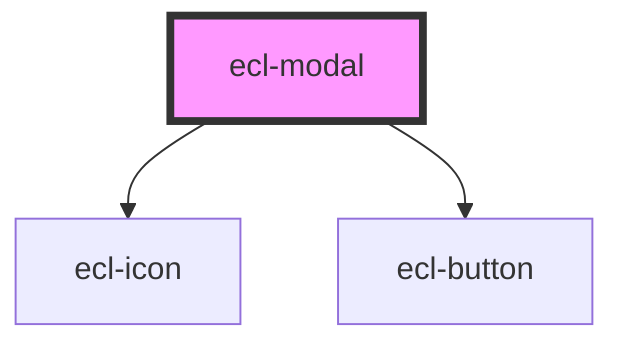

# ecl-modal

<!-- Auto Generated Below -->

## Properties

| Property        | Attribute         | Description | Type      | Default     |
| --------------- | ----------------- | ----------- | --------- | ----------- |
| `closeLabel`    | `close-label`     |             | `string`  | `undefined` |
| `eclScript`     | `ecl-script`      |             | `boolean` | `false`     |
| `itemId`        | `item-id`         |             | `string`  | `undefined` |
| `size`          | `size`            |             | `string`  | `'l'`       |
| `styleClass`    | `style-class`     |             | `string`  | `undefined` |
| `theme`         | `theme`           |             | `string`  | `'ec'`      |
| `toggleId`      | `toggle-id`       |             | `string`  | `undefined` |
| `variant`       | `variant`         |             | `string`  | `'default'` |
| `withBody`      | `with-body`       |             | `boolean` | `false`     |
| `withBodyFixed` | `with-body-fixed` |             | `boolean` | `false`     |
| `withFooter`    | `with-footer`     |             | `boolean` | `false`     |
| `withHeader`    | `with-header`     |             | `boolean` | `false`     |

## Dependencies

### Depends on

- [ecl-icon](../ecl-icon)
- [ecl-button](../ecl-button)

### Graph

----------------------------------------------

*Built with [StencilJS](https://stenciljs.com/)*
