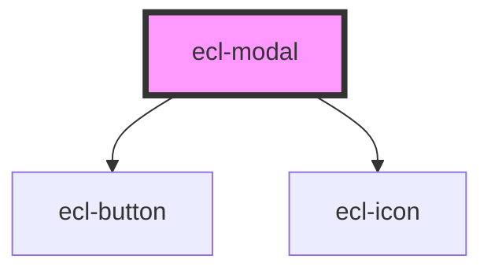

# ecl-modal

<!-- Auto Generated Below -->

## Properties

| Property     | Attribute     | Description | Type      | Default     |
| ------------ | ------------- | ----------- | --------- | ----------- |
| `closeLabel` | `close-label` |             | `string`  | `undefined` |
| `eclScript`  | `ecl-script`  |             | `boolean` | `false`     |
| `itemId`     | `item-id`     |             | `string`  | `undefined` |
| `styleClass` | `style-class` |             | `string`  | `undefined` |
| `theme`      | `theme`       |             | `string`  | `'ec'`      |
| `toggleId`   | `toggle-id`   |             | `string`  | `undefined` |
| `variant`    | `variant`     |             | `string`  | `'default'` |
| `withBody`   | `with-body`   |             | `boolean` | `false`     |
| `withFooter` | `with-footer` |             | `boolean` | `false`     |
| `withHeader` | `with-header` |             | `boolean` | `false`     |

## Dependencies

### Depends on

- [ecl-button](../ecl-button)
- [ecl-icon](../ecl-icon)

### Graph

----------------------------------------------

*Built with [StencilJS](https://stenciljs.com/)*
