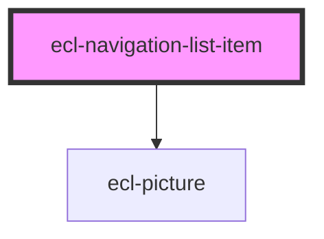

# ecl-navigation-list

<!-- Auto Generated Below -->

## Properties

| Property     | Attribute     | Description | Type      | Default     |
| ------------ | ------------- | ----------- | --------- | ----------- |
| `border`     | `border`      |             | `boolean` | `true`      |
| `image`      | `image`       |             | `string`  | `undefined` |
| `imageAlt`   | `image-alt`   |             | `string`  | `undefined` |
| `styleClass` | `style-class` |             | `string`  | `undefined` |
| `theme`      | `theme`       |             | `string`  | `'ec'`      |

## Dependencies

### Depends on

- [ecl-picture](../ecl-picture)

### Graph

----------------------------------------------

*Built with [StencilJS](https://stenciljs.com/)*
