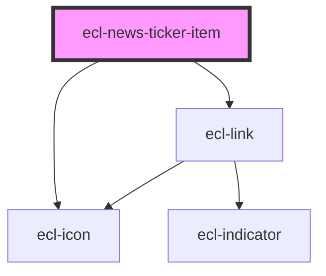

# ecl-news-ticker-item

<!-- Auto Generated Below -->

## Properties

| Property     | Attribute     | Description | Type     | Default     |
| ------------ | ------------- | ----------- | -------- | ----------- |
| `altAttr`    | `alt-attr`    |             | `string` | `undefined` |
| `icon`       | `icon`        |             | `string` | `undefined` |
| `image`      | `image`       |             | `string` | `undefined` |
| `path`       | `path`        |             | `string` | `undefined` |
| `styleClass` | `style-class` |             | `string` | `undefined` |
| `theme`      | `theme`       |             | `string` | `undefined` |
| `titleAttr`  | `title-attr`  |             | `string` | `undefined` |

## Dependencies

### Depends on

- [ecl-icon](../ecl-icon)
- [ecl-link](../ecl-link)

### Graph

----------------------------------------------

*Built with [StencilJS](https://stenciljs.com/)*
