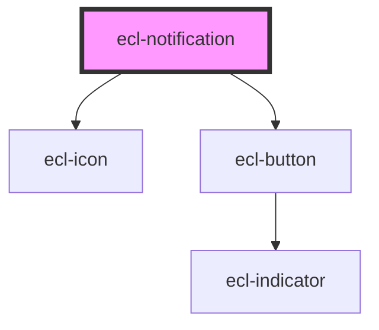

# ecl-message

<!-- Auto Generated Below -->

## Properties

| Property            | Attribute            | Description | Type      | Default     |
| ------------------- | -------------------- | ----------- | --------- | ----------- |
| `closeLabel`        | `close-label`        |             | `string`  | `undefined` |
| `eclScript`         | `ecl-script`         |             | `boolean` | `false`     |
| `notificationTitle` | `notification-title` |             | `string`  | `undefined` |
| `styleClass`        | `style-class`        |             | `string`  | `undefined` |
| `theme`             | `theme`              |             | `string`  | `undefined` |
| `variant`           | `variant`            |             | `string`  | `'info'`    |
| `withClose`         | `with-close`         |             | `boolean` | `true`      |

## Dependencies

### Depends on

- [ecl-icon](../ecl-icon)
- [ecl-button](../ecl-button)

### Graph

----------------------------------------------

*Built with [StencilJS](https://stenciljs.com/)*
