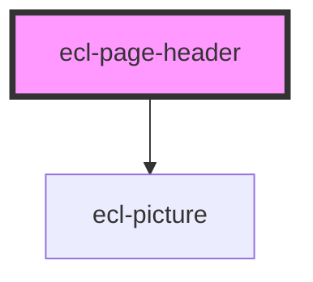

# ecl-page-header

<!-- Auto Generated Below -->

## Properties

| Property       | Attribute       | Description | Type     | Default     |
| -------------- | --------------- | ----------- | -------- | ----------- |
| `headerTitle`  | `header-title`  |             | `string` | `undefined` |
| `image`        | `image`         |             | `string` | `undefined` |
| `imageAlt`     | `image-alt`     |             | `string` | `undefined` |
| `meta`         | `meta`          |             | `string` | `undefined` |
| `overlay`      | `overlay`       |             | `string` | `undefined` |
| `styleClass`   | `style-class`   |             | `string` | `''`        |
| `theme`        | `theme`         |             | `string` | `'ec'`      |
| `thumbnail`    | `thumbnail`     |             | `string` | `undefined` |
| `thumbnailAlt` | `thumbnail-alt` |             | `string` | `undefined` |
| `variant`      | `variant`       |             | `string` | `'default'` |

## Dependencies

### Depends on

- [ecl-picture](../ecl-picture)

### Graph

----------------------------------------------

*Built with [StencilJS](https://stenciljs.com/)*
