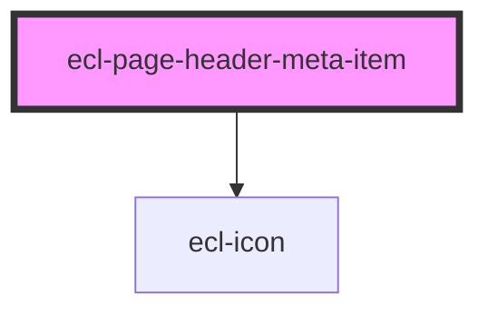

# ecl-page-header

<!-- Auto Generated Below -->

## Properties

| Property     | Attribute     | Description | Type     | Default     |
| ------------ | ------------- | ----------- | -------- | ----------- |
| `icon`       | `icon`        |             | `string` | `''`        |
| `styleClass` | `style-class` |             | `string` | `''`        |
| `theme`      | `theme`       |             | `string` | `undefined` |

## Dependencies

### Depends on

- [ecl-icon](../ecl-icon)

### Graph

```mermaid
graph TD;
  ecl-page-header-meta-item --> ecl-icon
  style ecl-page-header-meta-item fill:#f9f,stroke:#333,stroke-width:4px
```

----------------------------------------------

*Built with [StencilJS](https://stenciljs.com/)*
