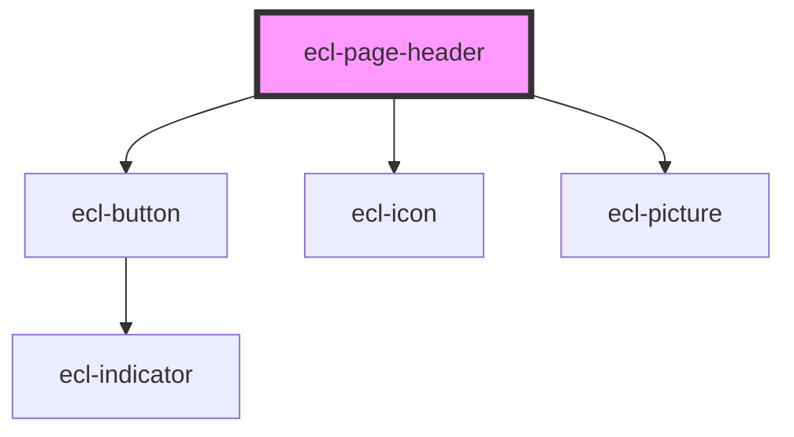

# ecl-page-header

<!-- Auto Generated Below -->

## Properties

| Property            | Attribute             | Description | Type      | Default                                                                             |
| ------------------- | --------------------- | ----------- | --------- | ----------------------------------------------------------------------------------- |
| `eclScript`         | `ecl-script`          |             | `boolean` | `false`                                                                             |
| `expandableContent` | `expandable-content`  |             | `string`  | `undefined`                                                                         |
| `expandableHeader`  | `expandable-header`   |             | `string`  | `undefined`                                                                         |
| `expandableLabel`   | `expandable-label`    |             | `string`  | `` `toggle panel's visibility` ``                                                   |
| `expandablePanelId` | `expandable-panel-id` |             | `string`  | `` `ecl-page-header-expandable-panel-${Math.random().toString(36).slice(2, 10)}` `` |
| `headerTitle`       | `header-title`        |             | `string`  | `undefined`                                                                         |
| `image`             | `image`               |             | `string`  | `undefined`                                                                         |
| `imageAlt`          | `image-alt`           |             | `string`  | `undefined`                                                                         |
| `meta`              | `meta`                |             | `string`  | `undefined`                                                                         |
| `overlay`           | `overlay`             |             | `string`  | `undefined`                                                                         |
| `styleClass`        | `style-class`         |             | `string`  | `''`                                                                                |
| `theme`             | `theme`               |             | `string`  | `undefined`                                                                         |
| `thumbnail`         | `thumbnail`           |             | `string`  | `undefined`                                                                         |
| `thumbnailAlt`      | `thumbnail-alt`       |             | `string`  | `undefined`                                                                         |

## Dependencies

### Depends on

- [ecl-button](../ecl-button)
- [ecl-icon](../ecl-icon)
- [ecl-picture](../ecl-picture)

### Graph

```mermaid
graph TD;
  ecl-page-header --> ecl-button
  ecl-page-header --> ecl-icon
  ecl-page-header --> ecl-picture
  ecl-button --> ecl-indicator
  style ecl-page-header fill:#f9f,stroke:#333,stroke-width:4px
```

----------------------------------------------

*Built with [StencilJS](https://stenciljs.com/)*
