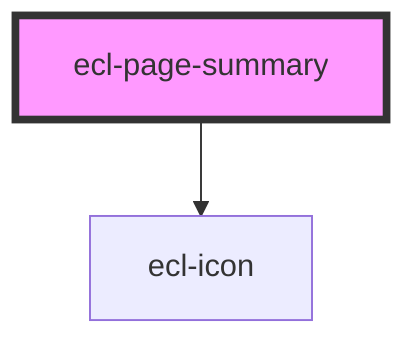

# ecl-page-summary

<!-- Auto Generated Below -->

## Properties

| Property         | Attribute         | Description | Type      | Default      |
| ---------------- | ----------------- | ----------- | --------- | ------------ |
| `colorMode`      | `color-mode`      |             | `string`  | `''`         |
| `elId`           | `el-id`           |             | `string`  | `''`         |
| `hasDescription` | `has-description` |             | `boolean` | `true`       |
| `icon`           | `icon`            |             | `string`  | `''`         |
| `iconFamily`     | `icon-family`     |             | `string`  | `'phosphor'` |
| `itemTitle`      | `item-title`      |             | `string`  | `''`         |
| `styleClass`     | `style-class`     |             | `string`  | `''`         |
| `theme`          | `theme`           |             | `string`  | `'ec'`       |

## Dependencies

### Depends on

- [ecl-icon](../ecl-icon)

### Graph

----------------------------------------------

*Built with [StencilJS](https://stenciljs.com/)*
